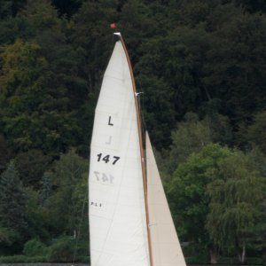

# Fokuspoint und der MM-Effekt Fokuspoint-Fit

CSS-gesteuertes Layout ist an sich eine feine Sache. Aber wenn die Bilder
unvorhersehbare Größen und Formate haben, wird es schon mal schwierig. Schnell ist das Layout zerschossen. 
Nicht dass es gar keine Lösung gäbe, aber ob das Ergebnis gefällt und der Aufwand tragbar ist, sei 
dahingestellt. 

Hier mal eine Beschreibung, wie mit dem Addon [**Focuspoint**](https://github.com/FriendsOfREDAXO/focuspoint/)
und dem darin enthalten Effekt **Focuspoint-Fit** der MediaManager verlässlichen Bilder-Input für das Layout erzeugt. 

- [Das Problem - warum ein neuer MM-Effekt **Fit** entstand](#A)
- [Die Sache mit dem Fokuspunkt](#B)
- [Anforderungen an den neuen Effekt **Focuspoint-Fit**](#C)
- [Wie **Focuspoint-Fit** rechnet](#D)
- [Fit ohne Fokuspunkt?](#E)
- [Typische Anwendungen](#F)
- [**Focuspoint-Fit** ohne **Focuspoint-Addon**](#G)

## Das Problem - warum ein neuer MM-Effekt **Fit** entstand

Bei einem Projekt wurden für Teaser quadratische Bilder benötigte. So sollte es aussehen

<bild vom Teaser1>
<bild vom Teaser2>

Das Quell-Material war jedoch wild gemischt was Größe und Format (Aspect-Ratio, AR) anbelangt. 

<originalbild 1> <originalbild 2

Eine Lösung wäre gewesen, bearbeitete Kopien der Originalbilder einzusetzen. Das fand ich
vom Workflow her schom immer lästig und per Saldo fehleranfällig - abgesehen davon, dass
am Ende mehrere Versionen eines Bildes im Medienpool stehen. Und was ist bei Layout-Änderungen? 

Eine andere Variante wäre, den dafür vorgesehenen MediaManager die Arbeit erledigen zu lassen. Bei wirrem
Ausgangsmaterial-Mix (mal höher, mal breiter) kommen die mitgelieferten Effekte an Ihre Grenzen. 
Resize z.B. passt entweder die eine Dimension genau ein und lässt die andere überstehen 
(keine verlässliche Zielgröße bzw. Zielformat) oder macht das Bild schmaler. Oder 
das Zielbild ist genau in ein vorgegebenes Format gebracht, aber bei abweichendem AR verzerrt. 

| zu schmal (255x300) | zu hoch (300x400) | verzerrt (300x300) |
| ---------- | -------------- | -------- |
|  |  |  |

So entstand die Idee für einen neuen Effekt "Fit", bei dem ein verlässliches Zielformat (AR)
oder noch besser eine genau vorgegebene Zielbildgröße sichergestellt wird. 
Der Preis dafür: Teile des Quellbildes müssen abgeschnitten werden, wenn die Aspect-Ratios (AR) nicht übereinstimmen. 

Der Fit-Effekt wäre somit eine intelligente Mischung aus Resize und Crop mit den Vorteilen

- verlässliches Ziel-Format, also kein zerschossenes Layout
- geringer Qualitätsverlust, da nur eine Bildumwandlung nötig ist

## Die Sache mit dem Fokuspunkt

Mit dem Kappen der Überstände ist es so eine Sache. Wie soll die Kappung eigendlich verteilt werden?
Verbreitet sind die Methoden

- "gleichverteilt", also links/rechts bzw. oben/unten je 50% des Überstandes
- "einseitig", also den gesamten Überstand an einer Seite. 

| einseitig oben | gleichverteilt oben und unten | einseitig unten |
| ---- | ----- | -------------- |
|  |  |  |

Die Meisten würden sich wohl für "gleichverteilt" entscheiden - aber 
mit hoher Wahrscheinlichkeit trifft man bei jeder Variante schnell auf Bilder und Formate, in denen das gewählte Verfahren
zu einem eher ungünstigen Bildauschnitt führt. Hier mal ein schmaler mittiger Auschnitt (gleichverteilt) für einen
Seitentitel.

 

Besser wäre dieser Auschnitt:

 

Es geht also um die Frage, wo eigentlich der Teil des Bildes ist, der unbedingt sichtbar sein sollte. 

Das Addon [**Focuspoint**](https://github.com/FriendsOfREDAXO/focuspoint/) ermöglicht, für ein Bild im Medienpool
festzulegen, wo der optischen Mittelpunkt des Bildes liegt. Um genau diesen Punkt herum sollten
Bildauschnitte platziert werden. Darüber läßt sich die Kappungs-Verteilung elegant steuern. 

Aus dem Effekt **Fit** wird der Effekt **Focuspoint-Fit**.

(Ja, das Beispiel mit dem Bootsbild zeigt auch, dass je nach Zielsetzung auch andere Fokuspunkte sinnvoll sein können:
das ganze Boot, nur der Rumpf, Segelnummer, Personen, .... Man muss sich halt für einen FP entscheiden.)

## Anforderungen an den neuen Effekt **Focuspoint-Fit**

Die Anforderungen waren also:

- Arbeite mit beliebigen Bildgrößen und Formaten (Aspect-Ratio)
- Erstelle ein Zielbild in verlässlicher Größe bzw. Format.
- Das Zielformat hat **immer** Priorität, ggf. werden überstehende Teile abgeschnitten.
- Ermögliche Zoom bzw. Auschnittsvergrößerung
- Orientierung am Fokuspunkt des Bildes (z.B. mit dem Addon **Focuspoint** zugewiesen)
- Fallback für den Fall, das Bilder keinen zugewiesenen Fokuspunkt haben.

## Wie **Focuspoint-Fit** rechnet

Ausgangspunkt ist ein Beispielbild in den Abmessungen 3072x2304 mit einem AR von 1,33 ( 4:3). 
Der Fokuspunkt ist gelb markiert und liegt bei 46% horizontal und 81% vertikal. 

 

Das Beispiel erzeugt quadratische Teaser-Bilder im Format 300x300 mit einem AR von 1:1 (also 1).
Die Einzelheiten werden jetzt Schritt für Schritt erklärt.

 

### Zielformat

Die Zielbildgröße wird fest vorgegeben. Es geht auch anders, zu diesem Sonderfall [später](#F1) mehr. 

 

### Den Engpass ermitteln

Im ersten Rechenschritt wird ermittelt, welche Dimension eigentlich den Engpass bildet. Im Beispiel 
(Original quer, Ziel quadratisch) ist offensichtlich, dass die Höhe den Engpass bildet. Konkret wird die
Engpass-Dimension aus den Aspect-Ratios errechnet:

- Original-AR > Ziel-AR: Engpass ist die Höhe
- Original-AR < Ziel-AR: Engpass ist die Breite
- Original-AR = Ziel-AR: egal; nimm Höhe

### Den Ausschnitt berechnen

Im zweiten Rechenschritt wird der Ausschnittsrahmen genau in der Größe des Zielbildes definiert, 
also hier 300 x 300 groß. Legen wir
ihn erst einmal oben links in die Ecke des Originalbildes (roter Rahmen):

 

Der gelbe senkrechte Strich markiert in der Engpass-Dimension den Platz, der zwischen Ausschnittshöhe und Originalhöhe verbleibt. 
Dieser Restplatz, im Beispiel 2004px, kann mit der Einstellung __"Zoom des Ausschnitts"__ in das Zielbild genommen weren. 
Entsprechend muss immer auch die jeweils andere Dimension des Ausschnitts neu berechnet werden, denn der AR des Zielbildes 
ist unbedingt einzuhalten.

 

| Auswahl | Auswirkung | Beispiel |
| ------- | ---------- | -------- |
| 0% | Es bleibt beim Zielausschnitt | 300x300 |
| 25% | 25% vom Rest wird mit in das Zielild genommen | 801x801 |
| 50% | 50% vom Rest wird mit in das Zielild genommen | 1302x1302 |
| 75% | 75% vom Rest wird mit in das Zielild genommen | 1803x1803 |
| 100% | Der komplette Rest wird mit in das Zielild genommen | 2304x2304 |

Im weiteren Verlauf des Beispiels rechnen wir mit der Variante "50%" weiter.

 

### Den Auschnittsrahmen um den Fokuspunkt positionieren

Im vierten Rechenschritt wird der Ausschnittsrahmen genau mittig auf den Fokuspunkt geschoben. Da der Fokuspunkt relativ weit
in der unteren Bildhälfte liegt, ragt der Rahmen folgerichtig über die Bildabmessungen hinaus. (Ah, deshalb 50%!). 

 

Das entstandene Problem lässt sich - wir wollen unbedingt den AR des Zielbildes erreichen - nur auf zwei Arten lösen:

- Verkleinere den Rahmen, so dass er komplett ins Bild passt; Fokuspunkt bleibt in der Mitte des Zielbildes
- Verschiebe den Bildrahmen soweit, dass er wieder innerhalb des Bildes liegt. Der Fokuspunkt liegt dann nicht mehr in der Mitte
des Zielbildes.

Die erste Variante kommt sehr schnell an Grenzen, wenn der Fokuspunkt nah am Bildrand liegt. Daher geht Focuspoint-Fit
den zweiten Weg. Nach dem fünften Rechenschritt haben wir also folgende Ausschnittsposition:

 

*Achtung - Nebenwirkung "Vergrößerung"*: Was pssiert eigentlich, wenn schon der ursprüngliche Ausschnittsrahmen (=Zielgröße) 
größer ist als das Originalbild?
Dann wird der Ausschittsrahmen unter Einhaltung des Ziel-AR soweit verkleinert, dass er in der Engpass-Dimmension wieder passt. 
Die Wirkung wäre also faktisch die Vergrößerung des Originalbildes. Der Zoom-Faktor bleibt dabei ohne Wirkung, logisch.  

### Zielbild erzeugen

Zum Schluß wird per **imagecopyresized** aus dem Originalbild das Zielbild in der Zielgröße errechnet.

 

## Fit ohne Fokuspunkt

Die Sache mit dem Fokuspunkt setzt voraus, dass die Bilder auch einen Fokuspunkt
haben. Und wenn nicht? Die einfachste Variante ist wieder die Annahme, dass der Fokuspunkt in der 
Bildmitte liegt (50%/50%). Aber das wäre ja zu einfach. 

Tatsächlich bietet die Effekt-Parametrisierung an, Fallback-Werte selbst festzulegen und deren Gültigkeit zu steuern.

 

## Typische Anwendungen

### Bilder größtmöglich auf ein Zielformat bringen

In dem Fall wird man den Zoom-Faktor auf 100% stellen, um möglichst viel vom Originalbild in das Zielbild zu 
überführen. Dank des Fokuspunktes wird dort gekappt wird, wo es am wenigsten weh tut.

Das obige Beispiel mit Zoom = 100% ergäbe;

 

### Bilder für Kopfzeilen/Banner erstellen

Die Bilder werden breit, aber nicht hoch. Auch hier würde sich Zoom = 100% anbieten. Das konkrete Zielformat hängt u.a.
vom Layout ab. Hier ein Beispiele siehe oben.
	
### Details herausheben

Das ist ein Anwendungsfall für Zoom-Faktoren unter 100%. Wenn das Zielformat und das Quellformat sehr deutlich voneinander
abweichen, kann ein Zoom-Faktor von 0% problematisch werden, da der Ausschnitt sehr klein wäre.

Sind die Originalbilder nur wenig (na ja, so bis 20%) größer als das Zielformat, bietet sich die 0%-Variante an.

### Gleichformatige und formatähnliche Originalbilder

Liegen die Quellbilder in einem verlässlichen Format vor und haben einen sehr ähnlichen Fokuspunkt (z.B. eine Reihe Portrait-Fotos)
kann man auch ohne bildindividuellen Fokuspunkt zum Ziel kommen. Hier ein Beispiel, bei dem Bilder in Format 3:4 vorliegen und 
auf 1:1 gekappt werden mit 10% Kappung oben.

Rechenbeispiel? Die Original-Bilder sind in der Größe 900x1200, das Zielformat ist 300x300, der Zoom-Faktor 100%. 
Der Bildausschnitt ist also 900x900. Der verbleibende Rest von 300 px 
in der Höhe muss gekappt werden. Oben werden 10% des Bildes gekappt = 120px. Der Rest (180px) wird unten gekappt. 
Das entspricht einem Fokuspunkt vertikal von 47%; der horizontale ist 50%.

 

| Original | Ziel |
| -------- | ---- |
|  |   |

### Bilder fester Breite und variabler Höhe

Die Bildgröße kann auch relativ angegeben werden. Allerdings sind relative Werte immer bezogen auf das Originalbild. Damit ist
am Ende kein verlässliches Zielformat zu erzeugen. Dennoch kann es tricky sein, diese Variante zu nutzen.

Setze man die Zielbreite fest und gibt keine Zielhöhe an, wird ein Zielbild erzeugt, dass eben genau die Zielbreite
aufweist. Der Aspect-ratio ergibt sich aus dem AR des   

-.......
.......

## **Focuspoint-Fit** ohne **Focuspoint-Addon**

Mit etwas Handarbeit ist auch das möglich. Es sei hier nur der Vollständigkeit halber beschrieben. 

Der Effekt Focuspoint-Fit ist zwar Teil des Addons, wird aber faktisch in den MediaManager eingebunden. Man kann also das 
Focuspoint-Addon herunterladen, die Effekt-Datei in ein anderes Addon (z.B. Projekt-Addon) kopieren und über dessen `boot.php`
aktivieren. Hier die Schritte im Detail:

- Kopiere `focuspoint/lib/class.rex\_effect\_focuspoint\_fit.php` nach `project/lib/class.rex\_effect\_focuspoint\_fit.php`.
- Übertrage die zum Effekt gehörenden Texte aus `focuspoint/lang/xx\_xx.lang` in die lang-Datei des Projektes.
- Aktiviere den Effekt in der `project/boot.php` mit dem Befehl `rex\_media\_manager::addEffect('rex\_effect\_focuspoint\_fit');`.

Ab dieser Stelle ist der Effekt verfügbar. Allerdings kann er nur auf Basis der vorab eingestellten Fallback-Werte
für Bilder ohne Fokuspunkt eingesetzt werden.  

Bildindividuelle Fokuspunkte werden möglich, wenn die Tabelle rex\_media mit einem zusätzlichen Meta-Feld versehen wird.
Von den zwei Feldern, die das Fokuspoint-Addon hinzufügt, nutzt Focuspoint-Fit nur den %-Wert im Feld med\_focuspoint\_css.
Dieses Feld müsste angelegt werden. Es tauch dann in den Metadaten der medien auf und kann befüllt werden. Eingaben müssen die
Form `x%, y%` habe. X und Y sind ganze Zahlen. Wenn man sich nicht an das Format hält -> kann klappen, kann auch nicht - im Zweifel "Pech gehabt".

Fazit: ja, es geht. Aber es ist wesentlich einfacher und im Handling komfortabler, das Fokuspoint-Addon zu installieren. 
Und Updates spielen sich auch einfacher ein.
