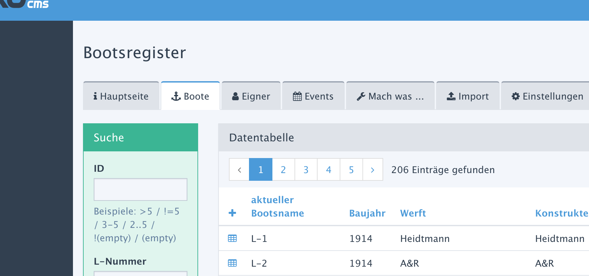

# YFORM-Tabellen und Formulare im eigenen Addon einbinden

* [1. Zielsetzung](#MA)
* [2. Zwei Schritte zum Glück](#MB)
* [3. Anmerkungen](#MC)
* [4. Testumgebung](#MD)

<a name="MA"></a>
## 1. Zielsetzung

YForm bietet sich an, Tabellen zu verwalten. Damit stehen auch jede Menge Feldtypen
und Validierungen zur Verfügung. Man findet dort auch so schöne Feldtypen wie
google/osm_geomap zur Karteneinbindung. Und es gib eine Suchfunktion, und Massenänderung,
 ...

Viele Addon basieren auf eigenen Tabellen und bauen sie z.B. mit rex_form und rex_list zusammen.
Nichts spricht gegen diese Vorgehensweise. Aber muss man *immer*
auf selbstgebaute Tabellen und Formulare aufsetzen? Oder lässt sich YForm elegant nutzen? So z.B.



**Hier soll gezeigt werden, wie einfach es möglich ist, per YForm verwaltete
Tabellen in einem Addon so zu nutzen, als seien es Addon-eigene Listen- und Formular-Seiten.**


<a name="MB"></a>
## 2. Zwei Schritte zum Glück

1. [Addon-Menü konfigurieren](#stepA)
1. [Helper-Funktion für das Addon-Menü schreiben](#stepB)


<a name="stepA"></a>
### 2.1 Addon-Menü konfigurieren

In der `package.yml` des Addons wird das Menü um Einträge erweitert, die jeweils eine
Tabelle anzeigen und die Bearbeitung ermöglichen:

```
page:
    title: 'Addon-Titel'
    subpages:
        orte:
            title: 'Orte'
            icon: rex-icon fa-map-marker
            subPath: lib/data_edit.php
            yformTable: rex_myaddon_orte
            yformClass: myaddon-yform
            yformTitle: false
        termine:
            title: 'Termine'
            icon: rex-icon fa-calendar
            subPath: lib/data_edit.php
            yformTable: rex_myaddon_termine
            yformClass: myaddon-yform
            yformTitle: false
```

"Normale" Menüpunkte würden zur Bearbeitung die Datei `myaddon/pages/orte.php` bzw.
`myaddon/pages/termine.php` heranziehen.
Aber `subPath: lib/data_edit.php` leitet den Aufruf auf die Datei
`myaddon/lib/data_edit.php` um.

Damit `data_edit.php` unterscheiden kann, was eigentlich zu tun ist, wird mit zusätzlichen Parametern die Anforderung spezifiziert:

Property | Beschreibung
---| ---
yformTable | Der Name der Tabelle, die bearbeitet werden soll.(notwendig)
yformClass | CSS-Klassename für einen `<div>`-Tag, der um die generierte Seite gelegt wird. Das erleichtert die Suche in Output-Filtern und ermöglicht individuelle CSS Konfigurationen. (default: `<div>`-keine Klammer)
yformTitle | Wenn auf `false` gesetzt wird die (eigentlich im Addon überflüssige) Titelzeile ausgeblendet. Setzt voraus, dass `yformClass` gesetzt ist. (default: true)


<a name="stepB"></a>
### 2.2 Helper-Funktion für das Addon-Menü schreiben

Die eigentlich ausführende Funktion in YForm - das Original - findet sich in der Datei
`yform/plugins/manager/pages/data_edit.php` und sieht so aus:

```PHP
$table_name = rex_request('table_name', 'string');
$table = rex_yform_manager_table::get($table_name);

if ($table && rex::getUser() && (rex::getUser()->isAdmin() || rex::getUser()->getComplexPerm('yform_manager_table')->hasPerm($table->getTableName()))) {
    try {
        $page = new rex_yform_manager();
        $page->setTable($table);
        $page->setLinkVars(['page' => 'yform/manager/data_edit', 'table_name' => $table->getTableName()]);
        echo $page->getDataPage();
    } catch (Exception $e) {
        $message = nl2br($e->getMessage()."\n".$e->getTraceAsString());
        echo rex_view::warning($message);
    }
} else {
    if (!$table) {
        echo rex_view::warning(rex_i18n::msg('yform_table_not_found'));
    }
}
```

Dieser Code wird im Prinzip übernommen und bildet den Kern der Datei `lib/data_edit.php`.
Allerdings muss er in zwei Punkten modifiziert und ergänzt werden, um die Welt des
Addons und die Welt von YForm zusammenzubringen:

1. **$table_name aus der package.yml nehmen**

    Im Originalcode wird der Tabellenname aus den Request-Parametern abgelesen
    (`$table_name = rex_request('table_name', 'string');`). Das funktioniert beim ersten
    Aufruf aus dem Menü noch nicht; statt dessen soll die Property `yformTable` herangezogen werden.

2. **YForm mitteilen, dass die Tabellen/Formulare im Addon angezeigt werden**

    Dazu reicht es aus, den Url-Parameter "page" statt auf 'yform/manager/data_edit' auf
    die aktuelle Seite zu leiten. Deren Adresse steht ja aktuell schon in "page".

Die neue, eigene `lib/data_edit.php` könnte so aussehen:

```PHP
<?php
$target_page = rex_request( 'page', 'string' );

if( $target_page == 'yform/manager/data_edit' )
{
    $table_name = rex_request( 'table_name', 'string' );
    $envelope = '';
}
elseif( isset( $this->getProperty('page')['subpages'][rex_be_controller::getCurrentPagePart(2)] ) )
{
    $properties = $this->getProperty('page')['subpages'][rex_be_controller::getCurrentPagePart(2)];
    if( $sub=rex_be_controller::getCurrentPagePart(3) ) $properties = $properties['subpages'][$sub];
    $table_name = isset( $properties['yformTable'] ) ? $properties['yformTable'] : '';
    $envelope = isset( $properties['yformClass'] ) ? $properties['yformClass'] : '';
    $hideTitle = isset( $properties['yformTitle'] ) && $properties['yformTitle'] == false ?  "<style>.$envelope header.rex-page-header{display:none;}</style>": '';
}
else
{
    $table_name = '';
}

$table = rex_yform_manager_table::get($table_name);

if ($table && rex::getUser() && (rex::getUser()->isAdmin() || rex::getUser()->getComplexPerm('yform_manager_table')->hasPerm($table->getTableName()))) {
    try {
        $page = new rex_yform_manager();
        $page->setTable($table);
        $page->setLinkVars(['page' => $target_page, 'table_name' => $table->getTableName()]);
        if( $envelope ) echo "<div class=\"$envelope\">$hideTitle";
        echo $page->getDataPage();
        if( $class ) echo '</div>';
    } catch (Exception $e) {
        $message = nl2br($e->getMessage()."\n".$e->getTraceAsString());
        echo rex_view::warning($message);
    }
} else {
    if (!$table) {
        echo rex_view::warning(rex_i18n::msg('yform_table_not_found'));
    }
}
```


<a name="MC"></a>
## 3. Anmerkungen

### 3.1 Titelzeile

Die Titelzeile kann wohl nicht komplett unterdrückt werden. Sie kann nur entweder per
CSS ausgeblendet werden (wie im Code oben gezeigt) oder per Output-Filter herausgenommen werden. Schöner wäre es, wenn sie garnicht erzeugt werden würde.

Die Titelzeile kann alternativ via EP "PAGE_TITLE" auf "leer" gesetzt werden. Der entsprechende `<header>`-Tag wird trotzdem eingebaut. Er wäre zwar unsichtbar, aber in Systemen mit dem Addon [quick_navigation](https://github.com/FriendsOfREDAXO/quick_navigation) hilft das
auch nicht weiter, da die Quick-Navigation in den `<header>`-Tag gehängt wird.

### 3.2 Idee: Integration in YForm

Die `lib/data_edit.php` wie oben beschrieben ist geeeignet, die originale `yform/plugins/manager/pages/data_edit.php` zu ersetzen.

Der Aufruf in der package.yml des Addons wäre dann
```
    subPath: ../yform/plugins/manager/pages/data_edit.php
```

<a name="MD"></a>
## 4. Testumgebung

* REDAXO 5.5.1
* YFORM 2.3
